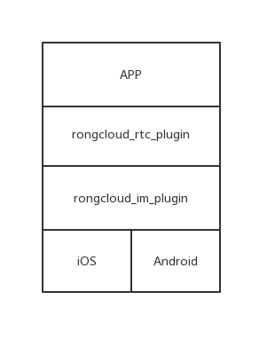
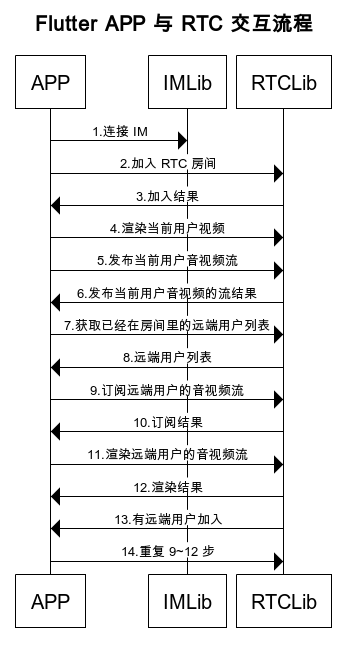

# 融云 RTC Flutter Plugin

本文档主要讲解了如何使用融云  RTC Flutter Plugin，基于 融云 iOS/Android 平台的  RTCLib  SDK

[Flutter 官网](https://flutter.dev/)

[融云 iOS RTC 文档](https://www.rongcloud.cn/docs/ios_RTClib.html)

[融云 Android RTC 文档](https://www.rongcloud.cn/docs/android_RTClib.html)

# 前期准备

## 1 申请开发者账号

登录[融云官网](https://www.rongcloud.cn)申请开发者账号

通过管理后台的 "基本信息"->"App Key" 获取 appkey

通过管理后台的 "IM 服务"—>"API 调用"->"用户服务"->"获取 Token"，通过用户 id 获取 IMToken

##2 开通音视频服务

管理后台的 "音视频服务"->"服务设置" 开通音视频 RTC 3.0 ，开通两个小时后生效


# 项目依赖关系




如图 RTC 依赖于 IM 发送信令

# 业务流程



# 接口说明


## 1.初始化 SDK

```
RongcloudImPlugin.init(RongAppKey);
```

## 2.连接 IM 

```
int rc = await RongcloudImPlugin.connect(IMToken);
print("连接 im " + rc.toString());
```

## 3.加入 RTC 房间

```
RongRTCEngine.joinRTCRoom(this.roomId,(int code) {
      
});
```

## 4.获取原生平台的 PlatformView

```
Widget view = RongRTCEngine.createPlatformView("userId", 200, 300, (int viewId) {
      
});

```

## 5.渲染当前用户的视频

```
RongRTCEngine.renderLocalVideo(viewId);
```


## 6.发布当前用户音视频流

```
RongRTCEngine.publishAVStream((int code) {

});
```

## 7.取消发布当前用户音视频流

```
RongRTCEngine.unpublishAVStream((int code) {

});

```

## 8.订阅远端用户的音视频流

```
RongRTCEngine.subscribeAVStream(userId,(int code) {
      
});
```

## 9.取消订阅远端用户的音视频流

```
RongRTCEngine.unsubscribeAVStream(userId,(int code) {

});
```

## 10.渲染远端用户的视频

```
RongRTCEngine.renderRemoteVideo(userId, viewId);
```

# 常见问题

## iOS 使用 Platform View 时报错：`[VERBOSE-2:platform_view_layer.cc(28)] Trying to embed a platform view but the PaintContext does not support embedding`

打开需要使用 Platform View 的 iOS 工程，在`Info.plist`中添加字段`io.flutter.embedded_views_preview`，其值为`YES`。
