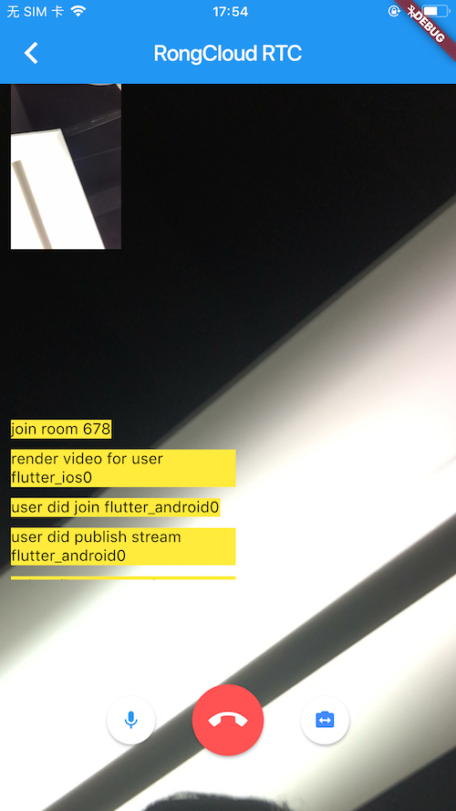
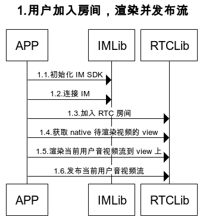
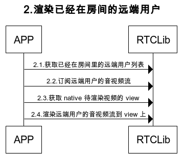
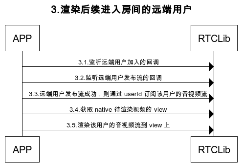

# 融云 RTC Flutter Plugin

本文档主要讲解了如何使用融云  RTC Flutter Plugin，基于 融云 iOS/Android 平台的  RTCLib  SDK

[Flutter 官网](https://flutter.dev/)

[融云 iOS RTC 文档](https://www.rongcloud.cn/docs/ios_RTClib.html)

[融云 Android RTC 文档](https://www.rongcloud.cn/docs/android_RTClib.html)

源码地址 [Github](https://github.com/rongcloud/rongcloud-rtc-flutter-sdk)，任何问题可以通过 Github Issues 提问

# 前期准备

## 1 申请开发者账号

[融云官网](https://developer.rongcloud.cn/signup/?utm_source=RTCfluttergithub&utm_term=RTCsign)申请开发者账号

通过管理后台的 "基本信息"->"App Key" 获取 AppKey

通过管理后台的 "IM 服务"—>"API 调用"->"用户服务"->"获取 Token"，通过用户 id 获取 IMToken

## 2 开通音视频服务

管理后台的 "音视频服务"->"服务设置" 开通音视频 RTC 3.0 ，开通两个小时后生效



# 依赖 RTC Flutter Plugin

在项目的 `pubspec.yaml` 中写如下依赖

```
dependencies:
  flutter:
    sdk: flutter

  rongcloud_rtc_plugin: ^0.9.6
```

iOS 需要在 Info.plist 中需要加入对相机和麦克风的权限申请

```
<key>NSCameraUsageDescription</key>
<string>使用相机</string>
<key>NSMicrophoneUsageDescription</key>
<string>使用麦克风</string>

```
还需要添加字段 `io.flutter.embedded_views_preview` 值为 `YES`

Android 需要在 AndroidManifest.xml 文件中声明对相机和麦克风的权限

```
    <uses-permission android:name="android.permission.CAMERA" />
    <uses-permission android:name="android.permission.MODIFY_AUDIO_SETTINGS" />
    <uses-permission android:name="android.permission.RECORD_AUDIO" />
    <uses-permission android:name="android.permission.INTERNET" />
```

# 项目依赖关系


`如图 RTC 依赖于 IM 发送信令`

# 音视频模式处理流程

## 1.用户加入房间，渲染并发布流的处理过程



## 2.渲染已经在房间的远端用户的处理过程



## 3.渲染后续进入房间的远端用户的处理过程



# 音视频模式接口说明

## 1.用户加入房间，渲染并发布流

### 1.1.初始化 IM SDK

```
RongcloudImPlugin.init(RongAppKey);
```

### 1.2.连接 IM

```
int rc = await RongcloudImPlugin.connect(IMToken);
print("连接 im " + rc.toString());
```

### 1.3.加入 RTC 房间

```
RongRTCEngine.joinRTCRoom(this.roomId,(int code) {
      
});
```

### 1.4.开始采集音视频

```
RongRTCEngine.startCapture();
```

### 1.5.获取 native 待渲染视频的 view

```
Widget view = RongRTCEngine.createPlatformView(userId, 200, 300, (int viewId) {
      
});

```

### 1.6.渲染当前用户音视频流到 view 上

```
RongRTCEngine.renderLocalVideo(viewId);
```

### 1.7.发布当前用户音视频流

```
RongRTCEngine.publishAVStream((int code) {

});
```

## 2.渲染已经在房间的远端用户

### 2.1.获取已经在房间里的远端用户列表

```
List userIds = await RongRTCEngine.getRemoteUsers(this.roomId);
```

### 2.2.订阅远端用户的音视频流
如果有多人存在，需要循环订阅

```
RongRTCEngine.subscribeAVStream(userId,(int code) {
      
});
```

### 2.3.获取 native 待渲染视频的 view

```
Widget view = RongRTCEngine.createPlatformView(userId, 200, 300, (int viewId) {
      
});

```

### 2.4.渲染远端用户的音视频流到 view 上

```
RongRTCEngine.renderRemoteVideo(userId, viewId,RongRTCVodioFillMode.Fill);
```

## 3.渲染后续进入房间的远端用户

### 3.1.监听远端用户加入的回调

`当用户加入的时候，不要做订阅渲染的处理`，因为此时该用户可能刚加入房间成功，但是尚未发布音视频流

```
RongRTCEngine.onUserJoined = (String userId) {
    
};
```

### 3.2.监听远端用户发布流的回调


```
RongRTCEngine.onUserStreamPublished = (String userId) {
  
};
```

### 3.3.远端用户发布流成功，则通过 userId 订阅该用户的音视频流

```
RongRTCEngine.subscribeAVStream(userId,(int code) {
      
});
```


### 3.4.获取 native 待渲染视频的 view

```
Widget view = RongRTCEngine.createPlatformView(userId, 200, 300, (int viewId) {
      
});

```

### 3.5.渲染该用户的音视频流到 view 上

```
RongRTCEngine.renderRemoteVideo(userId, viewId,RongRTCVodioFillMode.Fill);
```

# 纯音频模式处理流程

如果只使用纯音频模式，请参考[此文档](doc/AUDIO_ONLY.md)

## 其他接口

## 配置接口
配置分辨率，默认为 640x480

```
RongRTCEngine.config(RongRTCConfig.defaultConfig());
```

## 离开房间

```
RongRTCEngine.leaveRTCRoom(this.roomId,null);
```

## 取消发布当前用户音视频流

```
RongRTCEngine.unpublishAVStream((int code) {

});

```

## 取消订阅远端用户的音视频流

```
RongRTCEngine.unsubscribeAVStream(userId,(int code) {

});
```

## 当前用户静音

```
RongRTCEngine.muteLocalAudio(this.muted);
```

<!--## 切换两个用户视频
大小视频窗口切换

```
RongRTCEngine.exchangeVideo(mainSession.viewId, _getVideoSession(userId).viewId);
```-->

## 切换本地摄像头

```
RongRTCEngine.switchCamera();
```

## 移除渲染视频的 view

```
RongRTCEngine.removePlatformView(viewId);
```

更多接口[请参考源码](https://github.com/rongcloud/rongcloud-rtc-flutter-sdk)

# 常见问题

## iOS 无法加载视频页面并报错：[VERBOSE-2:platform_view_layer.cc(28)] Trying to embed a platform view but the PaintContext does not support embedding

打开 iOS 工程，在`Info.plist`中添加字段`io.flutter.embedded_views_preview`，其值为`YES`。
