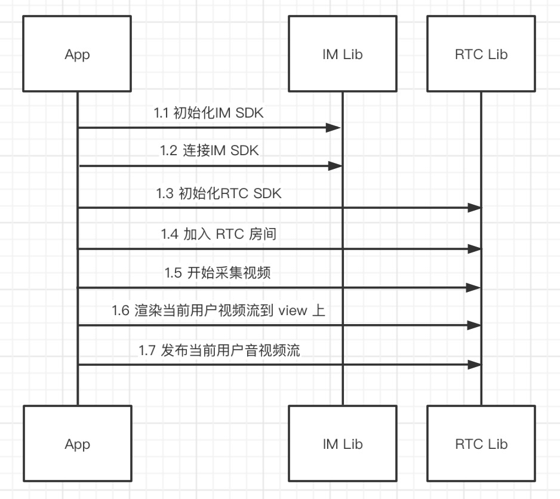
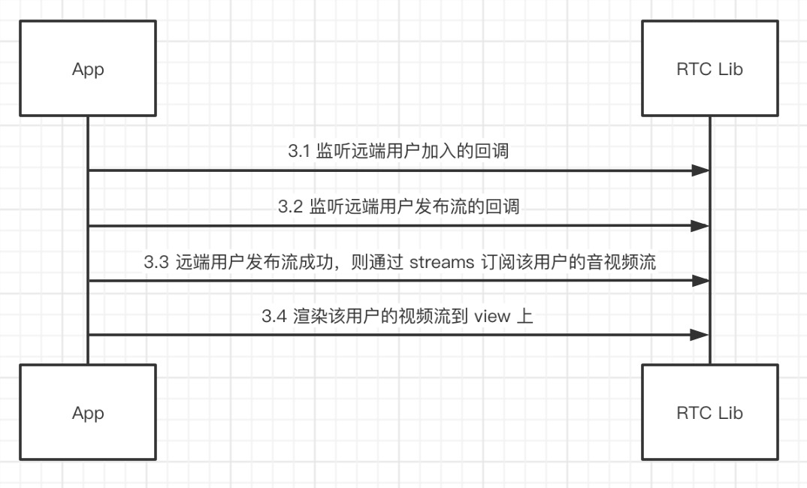

# 融云 RTC Flutter Plugin 
[](https://github.com/rongcloud/rongcloud-rtc-flutter-sdk) [](https://pub.dev/packages/rongcloud_rtc_plugin)


本文档主要讲解了如何使用融云  RTC Flutter Plugin，基于 融云 iOS/Android 平台的  RTCLib  SDK

[Flutter 官网](https://flutter.dev/)

[融云 iOS RTC 文档](https://www.rongcloud.cn/docs/ios_rtclib.html)

[融云 Android RTC 文档](https://www.rongcloud.cn/docs/android_rtclib.html)

源码地址 [Github](https://github.com/rongcloud/rongcloud-rtc-flutter-sdk)，任何问题可以通过 Github Issues 提问

# 前期准备

## 1 申请开发者账号

[融云官网](https://developer.rongcloud.cn/signup/?utm_source=RTCfluttergithub&utm_term=RTCsign)申请开发者账号

通过管理后台的 "基本信息"->"App Key" 获取 AppKey

通过管理后台的 "IM 服务"—>"API 调用"->"用户服务"->"获取 Token"，通过用户 id 获取 IMToken

## 2 开通音视频服务

管理后台的 "音视频服务"->"服务设置" 开通音视频 RTC 3.0 ，开通两个小时后生效

# 依赖 RTC Flutter Plugin

在项目的 `pubspec.yaml` 中写如下依赖

```
dependencies:
  flutter:
    sdk: flutter
  rongcloud_rtc_plugin: ^5.1.4+6
```

iOS 需要在 Info.plist 中需要加入对相机和麦克风的权限申请

```
<key>NSCameraUsageDescription</key>
<string>使用相机</string>
<key>NSMicrophoneUsageDescription</key>
<string>使用麦克风</string>
```
还需要添加字段 `io.flutter.embedded_views_preview` 值为 `YES`

Android 需要在 AndroidManifest.xml 文件中声明对相机和麦克风的权限

```
<uses-permission android:name="android.permission.CAMERA" />
<uses-permission android:name="android.permission.MODIFY_AUDIO_SETTINGS" />
<uses-permission android:name="android.permission.RECORD_AUDIO" />
<uses-permission android:name="android.permission.INTERNET" />
```

> **从 1.1.0 开始为方便排查 Android 问题将 RTC Flutter SDK Android 的包名改为 io.rong.flutter.rtclib**

# 项目依赖关系


`如图 RTC 依赖于 IM 发送信令`

# 音视频模式处理流程

## 1.用户加入房间，渲染并发布流的处理过程



## 2.渲染已经在房间的远端用户的处理过程


## 3.渲染后续进入房间的远端用户的处理过程



# 音视频模式接口说明

## 1.用户加入房间，渲染并发布流

### 1.1.初始化 IM SDK

```dart
RongIMClient.init(RongAppKey);
```

### 1.2.连接 IM

```dart
RongIMClient.connect(IMToken, (code, userId) {
});
```

### 1.3.初始化RTC SDK

```dart
RCRTCEngine.getInstance().init(null);
```

### 1.4.加入 RTC 房间

```dart
RCRTCRoomConfig roomConfig = RCRTCRoomConfig(
  RCRTCRoomType.Normal,
  RCRTCLiveType.AudioVideo,
  RCRTCLiveRoleType.Broadcaster,
);
RCRTCCodeResult result = await RCRTCEngine.getInstance().joinRoom(roomId, roomConfig);
```

### 1.5.开始采集视频

```dart
RCRTCCameraOutputStream stream = await RCRTCEngine.getInstance().getDefaultVideoStream();
stream.startCamera();
```

### 1.6.渲染当前用户视频流到 view 上

```dart
RCRTCCameraOutputStream stream = await RCRTCEngine.getInstance().getDefaultVideoStream();
RCRTCTextureView view = RCRTCTextureView(
  (view, id) {
    stream.setTextureView(id);
  },
  fit: BoxFit.contain,
  mirror: true,
);
```

### 1.7.发布当前用户音视频流

```dart
int code = await RCRTCEngine.getInstance().getRoom().localUser.publishDefaultStreams();
```

## 2.渲染已经在房间的远端用户

### 2.1.获取已经在房间里的远端用户列表

```dart
List<RCRTCRemoteUser> remoteUserList = RCRTCEngine.getInstance().getRoom().remoteUserList;
```

### 2.2.订阅远端用户的音视频流
循环订阅房间里远端用户的音视频流

```dart
for (RCRTCRemoteUser user in remoteUserList) {
	RCRTCEngine.getInstance().getRoom().localUser.subscribeStreams(user.streamList);
}
```

### 2.3.渲染远端用户的视频流到 view 上

```dart
for (RCRTCRemoteUser user in remoteUserList) {
  user.streamList.whereType<RCRTCVideoInputStream>().forEach((stream) {
    RCRTCTextureView view = RCRTCTextureView(
      (view, id) {
        stream.setTextureView(id);
      },
      fit: BoxFit.contain,
      mirror: false,
    );
  });
}
```

## 3.渲染后续进入房间的远端用户

### 3.1.监听远端用户加入的回调

`当用户加入的时候，不要做订阅渲染的处理`，因为此时该用户可能刚加入房间成功，但是尚未发布音视频流

```dart
RCRTCEngine.getInstance().getRoom().onRemoteUserJoined = (user) {
}
```

### 3.2.监听远端用户发布流的回调


```dart
RCRTCEngine.getInstance().getRoom().onRemoteUserPublishResource = (user, streams) {
};
```

### 3.3.远端用户发布流成功，则通过 streams 订阅该用户的音视频流

```dart
RCRTCEngine.getInstance().getRoom().localUser.subscribeStreams(streams);
```

### 3.4.渲染该用户的视频流到 view 上

```dart
streams.whereType<RCRTCVideoInputStream>().forEach((stream) {
  RCRTCTextureView view = RCRTCTextureView(
    (view, id) {
      stream.setTextureView(id);
    },
    fit: BoxFit.contain,
    mirror: false,
  );
});
```

# 直播模式处理流程

如果使用直播模式，请参考[此文档](doc/LIVE_MODE.md)

# 纯音频模式处理流程

如果使用纯音频模式，请参考[此文档](doc/AUDIO_ONLY.md)

## 其他接口

## 配置接口
配置视频流

```dart
RCRTCCameraOutputStream stream = await RCRTCEngine.getInstance().getDefaultVideoStream();
stream.setVideoConfig(config);
```

## 离开房间

```dart
int code = await RCRTCEngine.getInstance().leaveRoom();
```

## 取消发布当前用户音视频流

```dart
RCRTCEngine.getInstance().getRoom().localUser.unPublishDefaultStreams();
```

## 取消订阅远端用户的音视频流

```dart
int code = await RCRTCEngine.getInstance().getRoom().localUser.unsubscribeStreams(streams);
```

## 当前用户静音

```dart
RCRTCMicOutputStream stream = await RCRTCEngine.getInstance().getDefaultAudioStream();
stream.mute(mute);
```

## 切换本地摄像头

```dart
RCRTCCameraOutputStream stream = await RCRTCEngine.getInstance().getDefaultVideoStream();
bool isFront = await stream.switchCamera();
```

更多接口[请参考源码](https://github.com/rongcloud/rongcloud-rtc-flutter-sdk)

