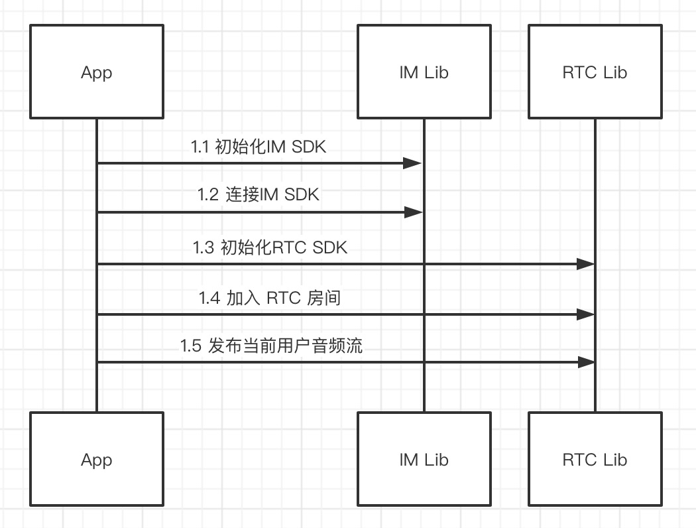
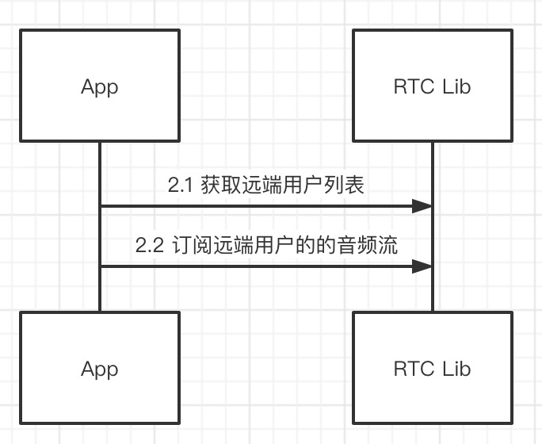
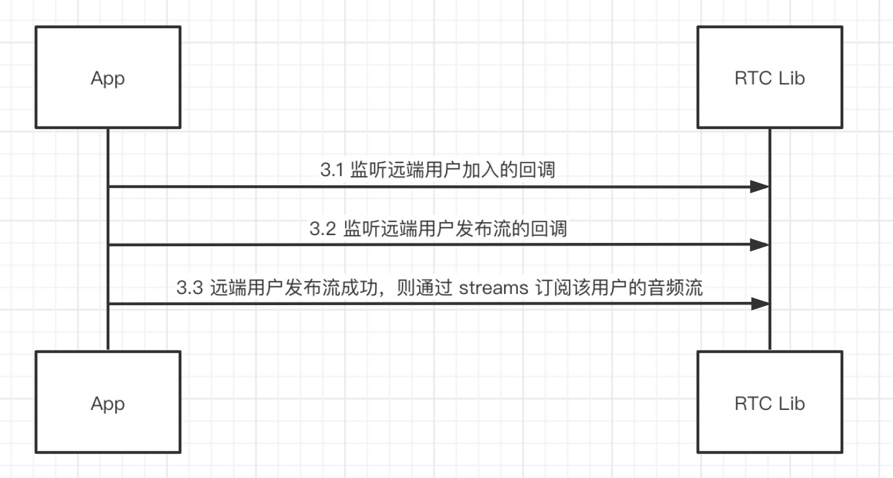

# 纯音频模式处理流程

## 1.用户加入房间，渲染并发布流的处理过程



## 2.渲染已经在房间的远端用户的处理过程



## 3.渲染后续进入房间的远端用户的处理过程



# 纯音频模式接口说明

## 1.用户加入房间，渲染并发布流

### 1.1.初始化 IM SDK

```dart
RongIMClient.init(RongAppKey);
```

### 1.2.连接 IM

```dart
RongIMClient.connect(IMToken, (code, userId) {
});
```

### 1.3.初始化 RTC SDK

```dart
RCRTCEngine.getInstance().init(null);
```

### 1.4.加入 RTC 房间

```dart
RCRTCRoomConfig roomConfig = RCRTCRoomConfig(
  RCRTCRoomType.Live,
  RCRTCLiveType.AudioVideo,
  RCRTCLiveRoleType.Broadcaster,
);
RCRTCCodeResult result = await RCRTCEngine.getInstance().joinRoom(roomId, roomConfig);
```

### 1.5.发布当前用户音频流

```dart
RCRTCMicOutputStream stream = await RCRTCEngine.getInstance().getDefaultAudioStream();
int code = await RCRTCEngine.getInstance().getRoom().localUser.publishStream(stream);
```


## 2.渲染已经在房间的远端用户

### 2.1.获取已经在房间里的远端用户列表

```dart
List<RCRTCRemoteUser> remoteUserList = RCRTCEngine.getInstance().getRoom().remoteUserList;
```

### 2.2.订阅远端用户的音频流
循环订阅房间里远端用户的音频流

```dart
RCRTCLocalUser localUser = RCRTCEngine.getInstance().getRoom().localUser;
for (RCRTCRemoteUser user in remoteUserList) {
	localUser.subscribeStreams(user.streamList.whereType<RCRTCAudioInputStream>().toList());
}
```

## 3.渲染后续进入房间的远端用户

### 3.1.监听远端用户加入的回调

`当用户加入的时候，不要做订阅渲染的处理`，因为此时该用户可能刚加入房间成功，但是尚未发布音频流

```dart
RCRTCEngine.getInstance().getRoom().onRemoteUserJoined = (user) {
}
```

### 3.2.监听远端用户发布流的回调


```dart
RCRTCEngine.getInstance().getRoom().onRemoteUserPublishResource = (user, streams) {
};
```

### 3.3.远端用户发布流成功，则通过 streams 订阅该用户的音频流

```dart
RCRTCEngine.getInstance().getRoom().localUser.subscribeStreams(streams.whereType<RCRTCAudioInputStream>().toList());
```