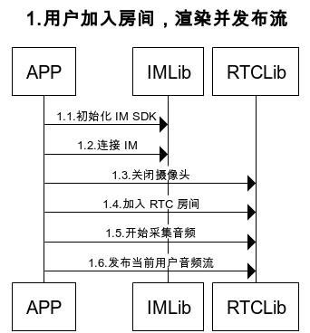
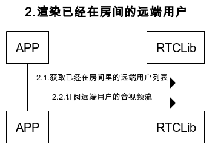
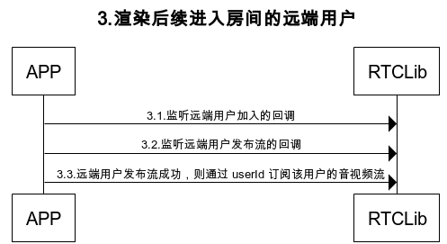

# 纯音频模式处理流程

纯音频模式与音视频模式相比，需要特殊处理的地方如下

```
1.提前关闭摄像头
2.不获取 native 的视频 view，不渲染视频
```
详细可以参考下面的流程与接口

## 1.用户加入房间，渲染并发布流的处理过程



## 2.渲染已经在房间的远端用户的处理过程



## 3.渲染后续进入房间的远端用户的处理过程



# 纯音频模式接口说明

## 1.用户加入房间，渲染并发布流

### 1.1.初始化 IM SDK

```
RongcloudImPlugin.init(RongAppKey);
```

### 1.2.连接 IM

```
int rc = await RongcloudImPlugin.connect(IMToken);
print("连接 im " + rc.toString());
```

### 1.3.关闭摄像头

```
RongRTCConfig conf = RongRTCConfig.defaultConfig();
// 关闭摄像头则只会发布音频
conf.cameraEnable = false;
RongRTCEngine.config(conf);
```

### 1.4.加入 RTC 房间

```
RongRTCEngine.joinRTCRoom(this.roomId,(int code) {
      
});
```

### 1.5.开始采集音频

```
RongRTCEngine.startCapture();
```

### 1.6.发布当前用户音频流

```
RongRTCEngine.publishAVStream((int code) {

});
```

## 2.渲染已经在房间的远端用户

### 2.1.获取已经在房间里的远端用户列表

```
List userIds = await RongRTCEngine.getRemoteUsers(this.roomId);
```

### 2.2.订阅远端用户的音视频流
如果有多人存在，需要循环订阅

```
RongRTCEngine.subscribeAVStream(userId,(int code) {
      
});
```

## 3.渲染后续进入房间的远端用户

### 3.1.监听远端用户加入的回调

`当用户加入的时候，不要做订阅渲染的处理`，因为此时该用户可能刚加入房间成功，但是尚未发布音视频流

```
RongRTCEngine.onUserJoined = (String userId) {
    
};
```

### 3.2.监听远端用户发布流的回调


```
RongRTCEngine.onUserStreamPublished = (String userId) {
  
};
```

### 3.3.远端用户发布流成功，则通过 userId 订阅该用户的音视频流

```
RongRTCEngine.subscribeAVStream(userId,(int code) {
      
});
```