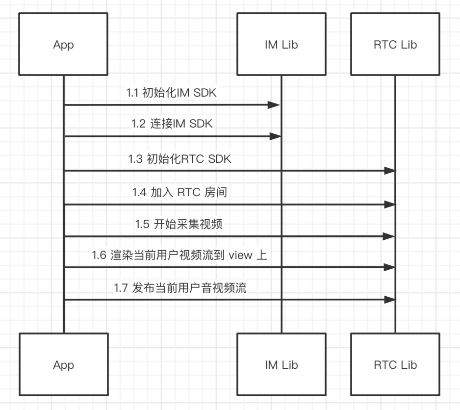
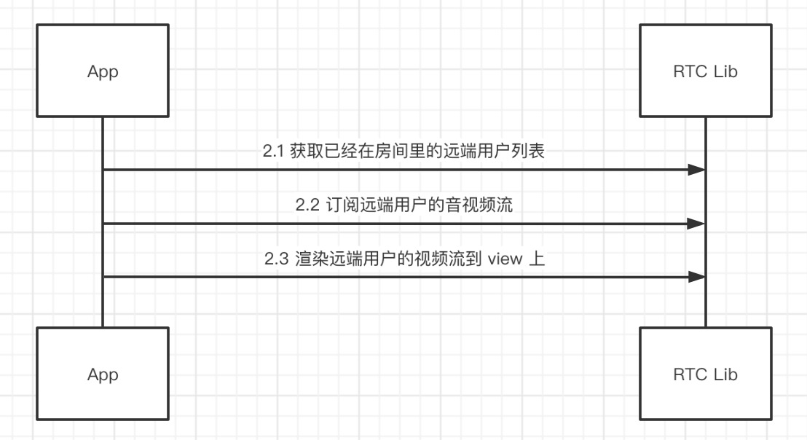
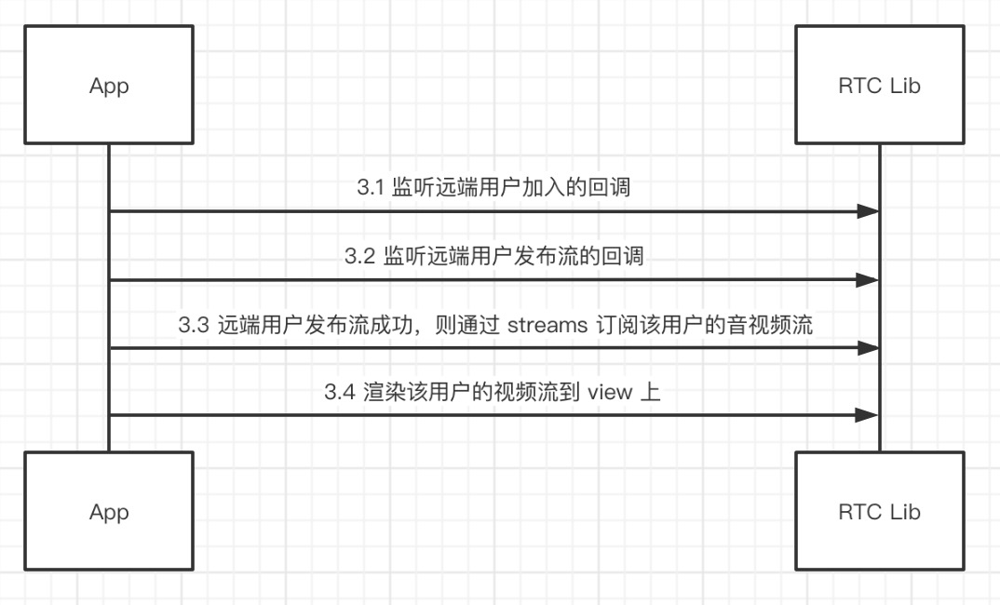
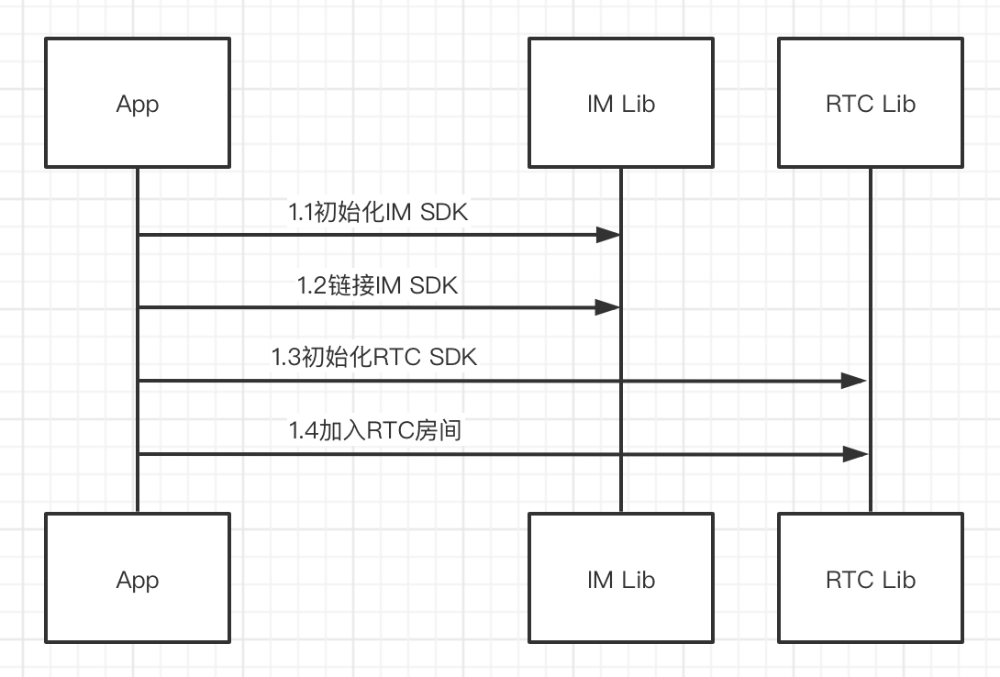
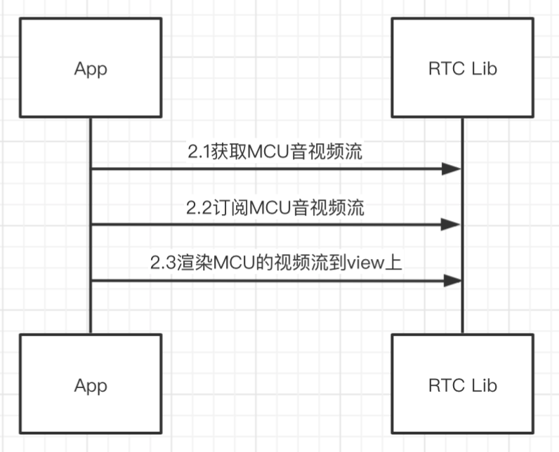
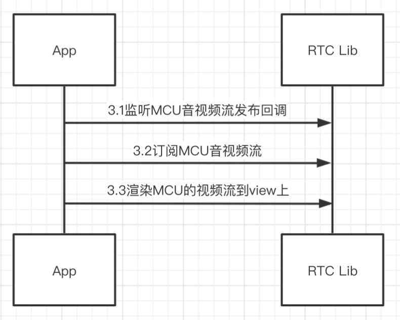

# 直播模式处理流程

## 主播端

### 1.主播加入房间，渲染并发布流的处理过程



### 2.渲染已经在房间的远端主播的处理过程



### 3.渲染后续进入房间的远端主播的处理过程



## 用户端

### 1.用户加入房间



### 2.渲染已经存在的MCU音视频流（用户加入房间时主播已经开播）



### 3.渲染后来的MCU音视频流（用户加入房间后，主播开播）



# 直播模式模式接口说明

## 主播端

### 1.主播加入房间，渲染并发布流

#### 1.1.初始化 IM SDK

```dart
RongIMClient.init(RongAppKey);
```

#### 1.2.连接 IM

```dart
RongIMClient.connect(IMToken, (code, userId) {
});
```

#### 1.3.初始化RTC SDK

```dart
RCRTCEngine.getInstance().init(null);
```

#### 1.4.加入 RTC 房间

```dart
RCRTCRoomConfig roomConfig = RCRTCRoomConfig(
  RCRTCRoomType.Live,
  RCRTCLiveType.AudioVideo,
  RCRTCLiveRoleType.Broadcaster,
);
RCRTCCodeResult result = await RCRTCEngine.getInstance().joinRoom(roomId, roomConfig);
```

#### 1.5.开始采集视频

```dart
RCRTCCameraOutputStream stream = await RCRTCEngine.getInstance().getDefaultVideoStream();
stream.startCamera();
```

#### 1.6.渲染当前主播视频流到 view 上

```dart
RCRTCCameraOutputStream stream = await RCRTCEngine.getInstance().getDefaultVideoStream();
RCRTCTextureView view = RCRTCTextureView(
  (view, id) {
    stream.setTextureView(id);
  },
  fit: BoxFit.contain,
  mirror: true,
);
```

#### 1.7.发布当前主播音视频流

```dart
int code = await RCRTCEngine.getInstance().getRoom().localUser.publishDefaultStreams();
```

### 2.渲染已经在房间的远端主播

#### 2.1.获取已经在房间里的远端主播列表

```dart
List<RCRTCRemoteUser> remoteUserList = RCRTCEngine.getInstance().getRoom().remoteUserList;
```

#### 2.2.订阅远端主播的音视频流
循环订阅房间里远端主播的音视频流

```dart
for (RCRTCRemoteUser user in remoteUserList) {
	RCRTCEngine.getInstance().getRoom().localUser.subscribeStreams(user.streamList);
}
```

#### 2.3.渲染远端主播的视频流到 view 上

```dart
for (RCRTCRemoteUser user in remoteUserList) {
  user.streamList.whereType<RCRTCVideoInputStream>().forEach((stream) {
    RCRTCTextureView view = RCRTCTextureView(
      (view, id) {
        stream.setTextureView(id);
      },
      fit: BoxFit.contain,
      mirror: false,
    );
  });
}
```

### 3.渲染后续进入房间的远端主播

#### 3.1.监听远端主播加入的回调

`当主播加入的时候，不要做订阅渲染的处理`，因为此时该主播可能刚加入房间成功，但是尚未发布音视频流

```dart
RCRTCEngine.getInstance().getRoom().onRemoteUserJoined = (user) {
}
```

#### 3.2.监听远端主播发布流的回调


```dart
RCRTCEngine.getInstance().getRoom().onRemoteUserPublishResource = (user, streams) {
};
```

#### 3.3.远端主播发布流成功，则通过 streams 订阅该主播的音视频流

```dart
RCRTCEngine.getInstance().getRoom().localUser.subscribeStreams(streams);
```

#### 3.4.渲染该主播的视频流到 view 上

```dart
streams.whereType<RCRTCVideoInputStream>().forEach((stream) {
  RCRTCTextureView view = RCRTCTextureView(
    (view, id) {
      stream.setTextureView(id);
    },
    fit: BoxFit.contain,
    mirror: false,
  );
});
```

## 观众端

### 1.观众加入房间

#### 1.1.初始化 IM SDK

```dart
RongIMClient.init(RongAppKey);
```

#### 1.2.连接 IM

```dart
RongIMClient.connect(IMToken, (code, userId) {
});
```

#### 1.3.初始化RTC SDK

```dart
RCRTCEngine.getInstance().init(null);
```

#### 1.4.加入 RTC 房间

```dart
RCRTCRoomConfig roomConfig = RCRTCRoomConfig(
  RCRTCRoomType.Live,
  RCRTCLiveType.AudioVideo,
  RCRTCLiveRoleType.Audience,
);
RCRTCCodeResult result = await RCRTCEngine.getInstance().joinRoom(roomId, roomConfig);
```

### 2.渲染已经存在的MCU合流（观众加入房间时主播已经开播）

#### 2.1.获取MCU音视频流

```dart
List<RCRTCInputStream> streams = await RCRTCEngine.getInstance().getRoom().getLiveStreams();
```

#### 2.2.订阅MCU音视频流

```dart
int result = await RCRTCEngine.getInstance().getRoom().localUser.subscribeStreams(streams);
```

#### 2.3.渲染MCU视频流到 view 上

```dart
streams.whereType<RCRTCVideoInputStream>().forEach((stream) {
  RCRTCTextureView view = RCRTCTextureView(
    (view, id) {
      stream.setTextureView(id);
    },
    fit: BoxFit.contain,
    mirror: false,
  );
});
```

### 3.渲染后来的MCU合流（观众加入房间后，主播开播）

#### 3.1.监听MCU音视频流发布回调

```dart
RCRTCEngine.getInstance().getRoom().onPublishLiveStreams = (streams) {
};
```

#### 3.2.订阅MCU音视频流

```dart
int result = await RCRTCEngine.getInstance().getRoom().localUser.subscribeStreams(streams);
```

#### 3.3.渲染MCU视频流到 view 上

```dart
streams.whereType<RCRTCVideoInputStream>().forEach((stream) {
  RCRTCTextureView view = RCRTCTextureView(
    (view, id) {
      stream.setTextureView(id);
    },
    fit: BoxFit.contain,
    mirror: false,
  );
});
```